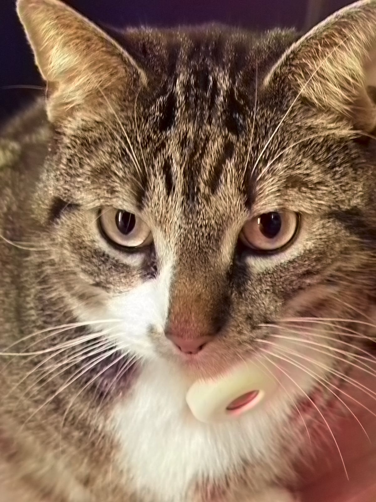

# ChromaFlow: AI-Powered Image Colorization

Transform black and white images into vibrant, colorized versions using state-of-the-art deep learning models. ChromaFlow is a comprehensive image colorization project that demonstrates different neural network architectures and their effectiveness in bringing historical photos to life.

## 🎨 Features

- **Multiple Model Architectures**: Compare results from ResNet18, VGG16, and quantized VGG16 models
- **Interactive Web Interface**: Modern React-based frontend with real-time comparison sliders
- **RESTful API**: FastAPI backend for seamless model inference
- **Model Quantization**: Optimized INT8 quantized model for faster inference
- **Gallery System**: View, download, and share your colorized creations
- **Dockerized Deployment**: Easy setup with Docker containers

## 🚀 Quick Start

### Prerequisites

- Python 3.12+
- Node.js 20+
- Docker (optional)
- Git LFS (for model weights)

### Installation

1. **Clone the repository**
   ```bash
   git clone https://github.com/atodorov284/image_colorizer.git
   cd image_colorizer
   ```

2. **Set up the Python environment**
   ```bash
   # Using uv (recommended)
   uv sync
   ```

3. **Install frontend dependencies**
   ```bash
   apt install npm
   apt install pnpm
   cd web
   pnpm install  # or npm install
   ```

5. **Download model weights**
   ```bash
   # Model weights are stored with Git LFS
   git lfs pull
   ```

### Running the Application

#### Option 1: Docker (Recommended)
```bash
docker-compose -f docker-compose.dev.yml up
```

Visit `http://localhost:3000` to access the application.

#### Option 2: Manual Setup
```bash
# Terminal 1: Start the API server
cd src
uvicorn api.main:app --reload --port 8000

# Terminal 2: Start the frontend
cd web
pnpm dev
```

Visit `http://localhost:3000` to access the application.

## 🏗️ Architecture

### Models

| Model | Architecture | Training Strategy | Use Case |
|-------|-------------|-------------------|----------|
| **ResNet18** | ResNet-18 backbone | MSE loss, Adam optimizer | Baseline model, fast inference |
| **VGG16** | VGG-16 backbone | Weighted L1 loss, rebalancing | Best quality, recommended |
| **VGG16 (Quantized)** | Dynamically quantized VGG-16 | INT8 quantization | Resource-constrained environments |

### Technical Details

- **Input Processing**: Images converted to LAB color space, L channel used as input
- **Output**: Predicted AB channels combined with original L channel
- **Color Space**: LAB color space for perceptually uniform colorization
- **Rebalancing**: Quantile-based weight rebalancing to handle color distribution bias
- **Quantization**: Dynamic INT8 quantization for 4x model size reduction


### Colorization Performance
| Original (Grayscale) | ResNet18 | VGG16 | VGG16 (Quantized) |
|:---:|:---:|:---:|:---:|
|  |  |  |  |
| *Bean's Headshot* | *Baseline Model* | *Recommended* | *Optimized* |


### Model Performance Summary

| Metric | ResNet18 | VGG16 | VGG16 (Quantized) |
|--------|----------|-------|-------------------|
| **Quality Score** | ⭐⭐⭐ | ⭐⭐⭐⭐⭐ | ⭐⭐⭐⭐ |
| **Speed** | 🚄 Fast (0.05s) | 🚂 Medium (0.07s) | 🚄 Fast (0.05s) |
| **Model Size** | 📦 51MB | 📦📦 129MB | 📦 34MB |
| **Best For** | Quick prototyping | Production quality | Mobile/Edge deployment |

> **💡 Pro Tip**: The VGG16 model generally produces the most vibrant and accurate colorizations, while the quantized version offers the best balance of quality and efficiency for resource-constrained environments.


### Training Statistics

- **Dataset**: COCO 2017 (106K filtered images)
- **Hardware**: A100 GPU (ResNet), 8x RTX 4090 (VGG)
- **Training Time**: ~1.3 hours (ResNet), ~13.7 hours (VGG)

## 🛠️ API Documentation

### Endpoints

#### `POST /predict`
Colorize an image using the specified model.

**Parameters:**
- `model`: Model type (`resnet`, `vgg`, `quant`)
- `image`: Image file (JPEG, PNG, BMP)

**Response:** Colorized image as PNG

#### `POST /preview`
Get grayscale preview of the uploaded image.

**Example:**
```bash
curl -X POST "http://localhost:8000/predict?model=vgg" \
     -H "Content-Type: multipart/form-data" \
     -F "image=@path/to/image.jpg" \
     --output colorized.png
```

## 📁 Project Structure

```
├── src/                    # Python source code
│   ├── api/               # FastAPI application
│   ├── models/            # Model architectures
│   ├── pipelines/         # Training pipelines
│   ├── utils/             # Utility functions
│   └── configs/           # Model configurations
├── web/                   # React frontend
│   ├── src/components/    # React components
│   ├── src/app/          # Next.js pages
│   └── public/           # Static assets
├── app/                   # Streamlit application
├── resnet/best_model/     # ResNet model weights
├── vgg/best_model/        # VGG model weights
└── docker-compose.dev.yml # Development setup
```

## 🎯 Usage Examples

### Web Interface
1. Visit the application at `http://localhost:3000`
2. Select your preferred model (VGG16 recommended)
3. Upload a black and white image
4. Click "Colorize Image" and wait for processing
5. Use the comparison slider to see results
6. Download or share your colorized image


### Command Line Training
```bash
# Train a new model
cd src
python train.py --config configs/vgg_config.yaml

# Quantize a trained model
python quantize.py --config configs/vgg_config.yaml

# Compare multiple models
python predict_compare.py
```

## 📄 License

This project is licensed under the MIT License - see the LICENSE file for details.

## 🙏 Acknowledgments

- **Zhang et al. (2016)** - "Colorful Image Colorization" for foundational research
- **COCO Dataset** - Microsoft COCO: Common Objects in Context
- **PyTorch Team** - For the deep learning framework
- **University of Groningen** - Academic support and resources

## 👥 Team

- **Alexander Todorov** - Teaching Assistant & Student at UG
- **Sven van Loon** - Docker Engineer & AI Student at UvA
- **Mika Umaña** - Front End Engineer & AI Student at UG
- **Christian Kobriger** - Data Science Student at ETH Zürich

## 📚 References

1. Zhang, Richard, Phillip Isola, and Alexei A. Efros. "Colorful image colorization." ECCV 2016.
2. He, Kaiming, et al. "Deep residual learning for image recognition." CVPR 2016.
3. Simonyan, Karen, and Andrew Zisserman. "Very deep convolutional networks for large-scale image recognition." ICLR 2015.
4. Lin, Tsung-Yi, et al. "Microsoft COCO: Common objects in context." ECCV 2014.

---

**Made with ❤️ in Groningen, Netherlands**
